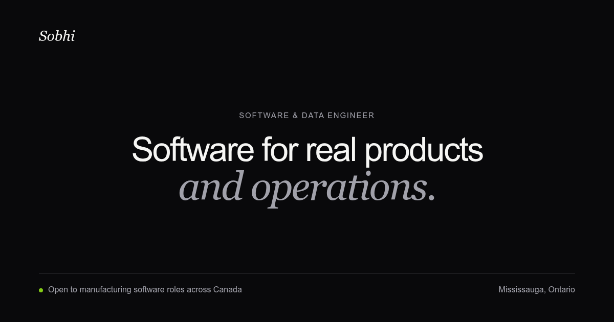

# Sobhi El-Safady

This is the source for my personal portfolio. I use it to document the software
I have built across manufacturing, robotics, embedded systems, and full-stack
product work.

The home page centres on a custom Three.js ringworld inspired by the ring in Halo CE. Scrolling moves the camera from an exterior orbit into the ring while the page introduces my work and
experience. I wanted the site to feel closer to a technical interface than a
standard portfolio template.



## Built with

- Astro 7 and TypeScript
- Tailwind CSS 4
- Three.js for the ringworld scene
- Astro content collections for project case studies

## Running it locally

You need a current Node.js release and npm.

```bash
npm install
npm run dev
```

Astro serves the development site at `http://localhost:4321`.

To check the production build:

```bash
npm run build
npm run preview
```

## Project layout

```text
src/
├── components/landing/    home-page sections
├── content/projects/      project write-ups and metadata
├── scripts/               Three.js ringworld scene
├── pages/                 Astro routes
└── styles/                global styles and design tokens

public/
├── og/                    social preview image
└── Sobhi-El-Safady-Resume.pdf
```

Each file in `src/content/projects/` creates a project page. The collection
schema lives in `src/content.config.ts`, and the project images live under
`src/images/projects/`.

## Production builds

Set `SITE_URL` when building for a public domain:

```bash
SITE_URL=https://your-domain.com npm run build
```

Astro uses that value for canonical URLs and the sitemap. Local builds omit
both when the variable is missing.

## Background

I started this repository from the
[Flaco theme by Lexington Themes](https://lexingtonthemes.com/templates/flaco),
then replaced the original pages, content, navigation, and visual system for
this portfolio. The ringworld scene and its scroll choreography were built for
this site.
